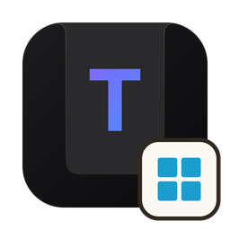
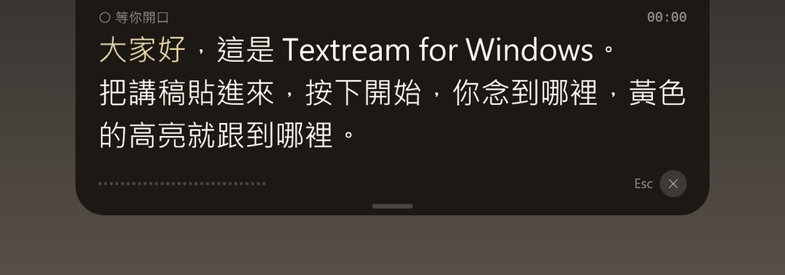
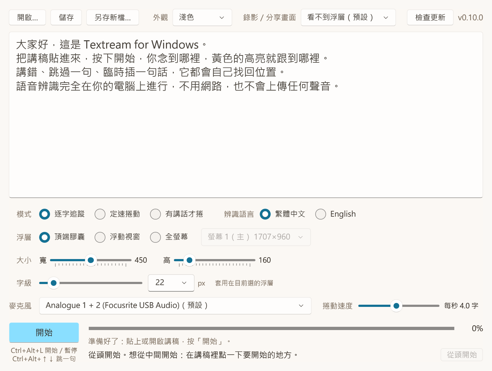
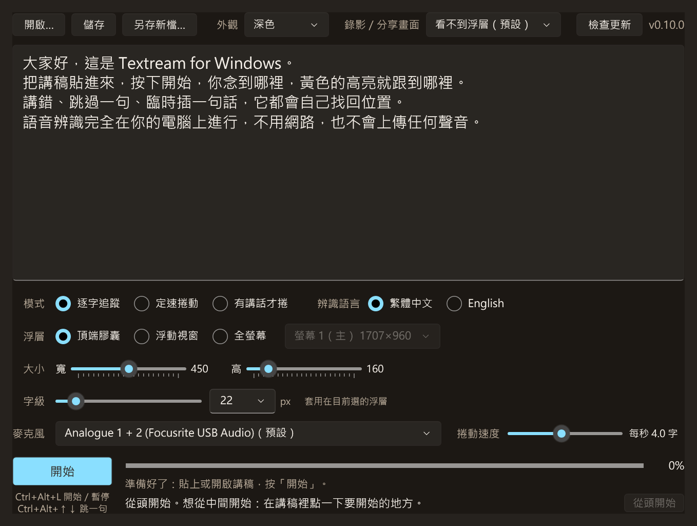
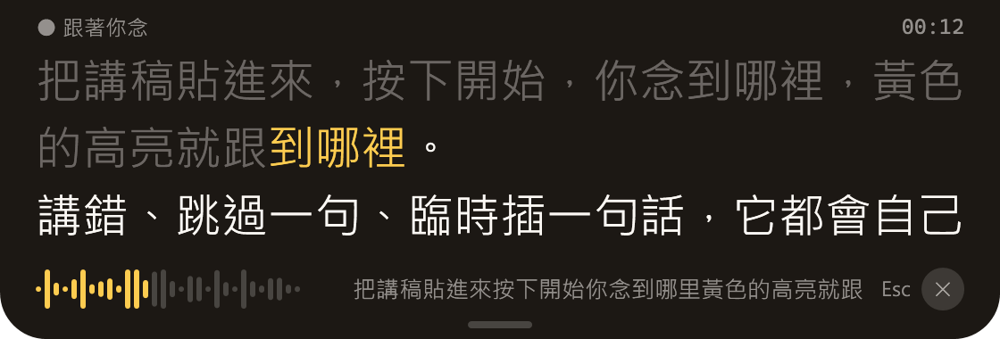
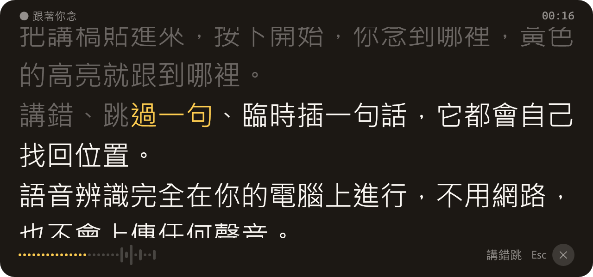
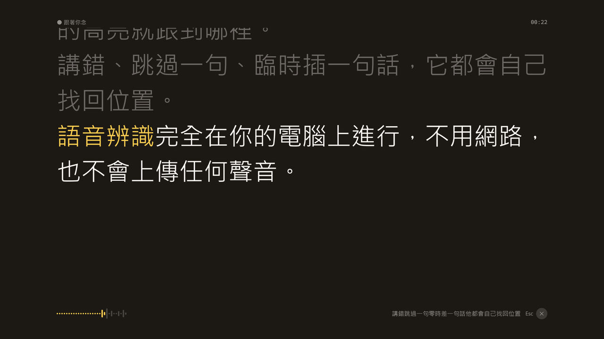

<p align="center">
  
</p>

<h1 align="center">Textream for Windows</h1>

<p align="center">
  <strong>會「聽你講到哪裡」的中文提詞機。免費、開源、完全離線。</strong>
</p>

<p align="center">
  <a href="#下載">下載</a> · <a href="#三步驟開始用">怎麼用</a> · <a href="#介面與設定">介面與設定</a> · <a href="#檢查更新">檢查更新</a> · <a href="#注意事項">注意事項</a> · <a href="#給開發者">給開發者</a> · <a href="#關於作者">關於作者</a>
</p>

<p align="center">
  
</p>

<p align="center"><sub>實際畫面：用 Windows 內建的中文語音念稿，Textream 即時辨識、高亮跟著走。右下角灰字是辨識出來的原文，有錯字也追得上。</sub></p>

---

## 下載

<table>
  <tr>
    <td>
      <strong><a href="https://github.com/wakichuang/textream-windows/releases/latest">下載最新版 Textream for Windows</a></strong><br>
      免安裝版 zip，約 380 MB，已內含語音模型，不用另外下載任何東西。<br>
      Windows 10（2004 版以後）或 Windows 11，64 位元，一支麥克風。不用另外安裝 .NET。
    </td>
  </tr>
</table>

到下載頁後，在「Assets」底下點 `Textream-for-Windows-版本-win-x64.zip`。

## Textream for Windows 是什麼？

把講稿貼進來、按「開始」、開口念，講稿就浮在螢幕最上方靠近鏡頭的地方，**你念到哪個字，黃色高亮就跟到哪個字**。
講錯、跳過一句、臨時插一段話，它會自己找回位置；停下來再開始，會從上次的地方接著念。
適合錄影片、直播、線上簡報、Podcast：眼睛看著鏡頭，不用一直低頭找稿子。

- **完全離線**：語音辨識在你的電腦上進行，不用網路、不會上傳任何聲音。
- **中文優先**：用拼音比對，簡繁、同音字、念錯字都追得上；中文夾英文也可以，整份英文稿也能切換成英文規則。
- **錄影時看不到**：預設錄影、截圖、Google Meet 分享畫面都看不到提詞，只有你自己看得到。

移植自 Mac 版的 [Textream](https://github.com/f/textream)（作者 Fatih Kadir Akin，MIT 授權），由 [瓦基（閱讀前哨站）](https://readingoutpost.com) 改成 Windows 版並加強中文。Mac 使用者可以用同樣由瓦基維護的 [Textream 繁中改版](https://github.com/wakichuang/textream-zh)。

## 三步驟開始用

1. **解壓縮**：在下載的 zip 上按右鍵 →「解壓縮全部」。**不要直接在 zip 裡點兩下執行**，會找不到語音模型。
2. **打開**：進到解壓縮出來的「Textream for Windows」資料夾，雙擊 `TextreamWindows.exe`。
   第一次打開如果跳出藍色的「Windows 已保護您的電腦」，按「其他資訊」→「仍要執行」（原因見[注意事項](#注意事項)）。
   想從開始功能表打開：在 `TextreamWindows.exe` 上按右鍵 →「釘選到開始畫面」。
3. **念稿**：把講稿貼進中間的大框框（或按「開啟…」選 `.txt`、`.md` 檔），模式選「逐字追蹤」，按「開始」或在任何程式裡按 `Ctrl+Alt+L`，然後照稿念。
   念完會停在「讀完了」，可以選「重來」或結束；中途按 `Esc` 停止，回到編輯畫面調一調稿子，再按「開始」就從游標的位置接著念。

## 介面與設定

<p align="center">
  
</p>

| 設定 | 說明 |
| :-- | :-- |
| **模式** | **逐字追蹤**：聽你念到哪個字就跟到哪（最常用）。**定速捲動**：照設定的速度一直往前，不聽聲音。**有講話才捲**：照速度往前，但只在你講話時前進，停下來就等你。 |
| **辨識語言** | 逐字追蹤時選「繁體中文」或「English」。中文講稿（中間夾英文也可以）選繁體中文；整份都是英文的講稿選 English。 |
| **浮層** | 講稿要浮在哪裡：**頂端膠囊**（貼在螢幕最上緣正中央，最靠近鏡頭）、**浮動視窗**（可拖曳、可拉大小）、**全螢幕**（蓋滿選定的螢幕，適合接第二個螢幕當提詞機）。 |
| **大小** | 頂端膠囊的寬和高；浮動視窗直接拖它的邊框調整，會記住。 |
| **字級** | 講稿的字有多大，三種浮層各記各的。 |
| **麥克風** | 用哪一支麥克風聽你念；預設是 Windows 的預設錄音裝置。 |
| **捲動速度** | 定速捲動與有講話才捲的速度，每秒幾個字。 |
| **外觀**（右上角） | 跟著系統、淺色、深色。浮層一律是深色。 |
| **錄影／分享畫面**（右上角） | **看不到浮層（預設）**：錄影、截圖、分享畫面都錄不到提詞。**錄得到浮層**：要錄示範影片給別人看時用。 |
| **檢查更新**（右上角） | 到 GitHub 看有沒有新版，旁邊是目前的版本號。 |
| **從頭開始**（右下角） | 游標放回講稿最前面。平常按「開始」是從游標的位置開始念，下方會寫要從哪裡開始。 |

字級、浮層大小與位置、速度、麥克風、辨識語言、外觀都會記住，下次打開照舊。

<details>
<summary>深色外觀長這樣</summary>
<p align="center">
  
</p>
</details>

### 三種浮層

| 頂端膠囊（預設） | 浮動視窗 |
| :--: | :--: |
|  |  |
| 貼在螢幕最上緣正中央，靠近筆電的鏡頭，看稿時視線接近看鏡頭。 | 可以拖到任何地方、拉成任何大小，適合放在攝影機旁邊。 |

<p align="center">
  
</p>
<p align="center"><sub>全螢幕：蓋滿選定的螢幕，字可以放很大，適合把第二個螢幕或提詞機玻璃後面的螢幕當成提詞畫面。</sub></p>

浮層上可以看到：

- **黃色**：你正要念的 2～4 個字。讀過的字變灰，還沒讀的是白色，講稿會平滑地往上捲。
- **左上角**：狀態（跟著你念、等你開口、暫停中）；右上角是經過的時間。
- **左下角**：麥克風的音量條，確認它有聽到你。
- **右下角**：剛剛聽到的話（辨識原文），以及停止鍵（或按 `Esc`）。
- 在浮層上**點任何一個字**，就從那個字開始；**轉滾輪**一格跳一行。

### 快捷鍵（在任何程式裡都能按）

| 快捷鍵 | 作用 |
| :-- | :-- |
| `Ctrl+Alt+L` | 開始／暫停；讀完時是「重來」 |
| `Ctrl+Alt+↑`／`Ctrl+Alt+↓` | 跳到上一句／下一句 |
| `Esc` | 停止（浮層在畫面上時） |

## 檢查更新

Textream for Windows 每次打開時，會在背景到 GitHub 看有沒有新版：

- **有新版**：跳出視窗告訴你最新版本與你目前的版本，按「前往下載」會用瀏覽器打開 GitHub 的下載頁；按「稍後」就下次再說。正在念稿時不會打擾你。
- **已是最新版、沒有網路**：什麼都不會跳出來。
- 想自己確認：按主視窗右上角的「**檢查更新**」，旁邊寫著目前的版本號。

**更新的方法**：下載新版的 zip、解壓縮，取代舊的「Textream for Windows」資料夾就好。
設定存在 `%APPDATA%\Textream\settings.json`，講稿存在你自己選的地方，換新版都不會不見。

## 注意事項

### 給使用者

- **「Windows 已保護您的電腦」**：這是個人免費分享的程式，沒有購買程式碼簽章憑證，Windows SmartScreen 會提醒一次。按「其他資訊」→「仍要執行」即可。原始碼全部公開在這個 repo，也可以自己從原始碼建置。
- **一定要先解壓縮**，而且 `models` 資料夾要跟 `TextreamWindows.exe` 放在一起。只把 exe 複製到別處會「找不到語音模型」。
- **聽不到聲音**：Windows「設定 → 隱私權與安全性 → 麥克風」，打開「麥克風存取」與「讓桌面應用程式存取您的麥克風」，再到 Textream 的「麥克風」選單選對裝置。名稱有 Virtual 的虛擬音效裝置通常不是你要的。
- **隱私**：語音辨識全部在你的電腦上進行，聲音與講稿都不會離開你的電腦。唯一會連上網路的是「檢查更新」：它只向 GitHub 詢問最新版本號，不會送出任何講稿、聲音或個人資料。
- **錄影時看不到浮層**用的是 Windows 的「不讓畫面擷取」功能（`WDA_EXCLUDEFROMCAPTURE`），實測 Loom 錄影錄不到；一般透過 Windows 擷取畫面的錄影、截圖、分享畫面軟體也都錄不到。但用手機或攝影機對著螢幕拍，當然還是看得到。
- **快捷鍵被別的程式佔用**時，主視窗下方會提示哪一組沒有註冊成功，那一組請改用滑鼠操作。
- **辨識語言**：中文講稿裡夾英文單字，維持「繁體中文」就好；英文人名或專有名詞常常辨識不準，但高亮會靠前後的字追上去。整份英文稿再切到「English」。
- **電腦負擔**：逐字追蹤大約用掉一顆 CPU 核心的一部分（在 i7-12700 上整台約 14%），同時錄影沒有問題。按「開始」後載入語音模型要 1～2 秒。
- **多螢幕、不同縮放比例**的組合還沒有完整測過；遇到浮層位置怪怪的，歡迎到 [Issues](https://github.com/wakichuang/textream-windows/issues) 回報。
- 只提供 64 位元（x64）版本。

### 給軟體開發者

- 開發規則（TDD、紅綠循環、全部測試全綠才 commit、警告即錯誤）寫在 [`AGENTS.md`](AGENTS.md)，AI 協作者與人類開發者都照這份。
- **語音模型不進 repo**（每個 100～700 MB）。開發時用 `python scripts/fetch_models.py A` 下載到 `%LOCALAPPDATA%\Textream\models`；程式找模型的順序是環境變數 `TEXTREAM_MODELS_DIR` → 執行檔旁的 `models` → `%LOCALAPPDATA%\Textream\models`。
- `TextreamWindows.Core` 是純邏輯，**不准引用 Windows 專屬 API**，要能在任何平台單獨測。字數一律用文字元素（grapheme）計算，不要用 `string.Length`。
- **黃金錄音測試**用真人錄音回放，錄音不進 repo；用環境變數 `TEXTREAM_GOLDEN_DIR`、`TEXTREAM_PODCAST`（或 repo 根目錄的 `golden.local`）指過去，沒有就略過。CI 一律略過。
- 指令一律用 `python`，不是 `python3`（很多 Windows 上 `python3` 是微軟商店的假殼）。有些電腦沒開長路徑，路徑超過 260 字元會失敗，建置資料夾不要放太深。
- 程式開著時 `bin` 會被鎖住，可以用 `dotnet build --artifacts-path <暫存資料夾>` 建到別處；這時黃金錄音測試找不到 `golden.local`，記得改設環境變數。
- **發佈新版**：改 `src/TextreamWindows.App/TextreamWindows.App.csproj` 的 `<Version>` → 全部測試全綠 → `python scripts/publish.py` → 在 GitHub 建 tag 為 `v版本號` 的 Release 並上傳 zip。**不要勾「預覽版（pre-release）」**：檢查更新查的是 GitHub 的「最新版」，預覽版不算最新版，使用者會收不到通知。
- 新增第三方套件、資料或素材時，在 [`THIRD_PARTY_NOTICES.md`](THIRD_PARTY_NOTICES.md) 補一節（來源、版本、用途、授權）；換語音模型前先確認授權允許公開轉散布。

## 給開發者

需要 [.NET 10 SDK](https://dotnet.microsoft.com/download)（`winget install Microsoft.DotNet.SDK.10`）與 Python 3。

```powershell
python scripts/fetch_models.py A          # 下載語音模型 A 到 %LOCALAPPDATA%\Textream\models（約 500 MB）
dotnet test TextreamWindows.slnx          # 全部測試
dotnet run --project src/TextreamWindows.App
python scripts/publish.py                 # 打包免安裝版 zip 到 publish/
```

| 專案 | 用途 |
| :-- | :-- |
| `src/TextreamWindows.Core` | 純邏輯：斷字、拼音、數字正規化、對齊（含跳句、插話的容錯，中英文兩套規則）、VAD、模式狀態機、檢查更新的版本比對 |
| `src/TextreamWindows.Speech` | sherpa-onnx 包裝、麥克風、WAV／MP3 回放 |
| `src/TextreamWindows.App` | WPF 介面：編輯器、三種浮層、快捷鍵、錄影時隱藏、檢查更新 |
| `src/TextreamWindows.Lab` | 開發用主控台工具：列麥克風、錄音、辨識、量延遲、`follow` 試念（`--lang en` 用英文規則） |
| `tests/*` | 對應的 xUnit 測試；`Desktop.Tests` 需要真的 Windows 桌面，只在本機跑 |

語音辨識用 [sherpa-onnx](https://github.com/k2-fsa/sherpa-onnx) 的串流模型 `sherpa-onnx-streaming-zipformer-bilingual-zh-en-2023-02-20`（中英雙語，Apache-2.0）。
`scripts/fetch_models.py --list` 可以看其他候選模型，比較準確度與延遲用 `TextreamWindows.Lab bench`。

## 關於作者

Textream for Windows 由[瓦基](https://readingoutpost.com/)製作。我是書評部落格《閱讀前哨站》和說書頻道《下一本讀什麼？》的創辦人，錄 Podcast、錄影片，都是看著稿子講。在 Mac 上用過 Textream 之後，我也想在 Windows 上有一套聽得懂中文、跟著聲音走的提詞機，乾脆自己動手做，順便把中文的比對加強，公開給同樣需要的人。

► 想認識更多關於我？

- [閱讀前哨站](https://readingoutpost.com/)：我的書評部落格，寫讀過的書和心得
- [下一本讀什麼？](https://readingoutpost.com/podcast/)：說書 Podcast
- [AI 瓦基第二大腦](https://readingoutpost.com/recommends/waki-ai/)：線上課程。你想讓 AI 成為工作夥伴，而不是用得越多越挫折嗎？我將一人公司的方法結合 AI 協作，設計出一套簡單好上手的 AI 課程。跟著流程走，透過十個專案包示範，帶你做出好成果。

這個程式永遠免費。如果它讓你錄影時少低頭找幾次稿，**點顆星**我會很開心；但真正讓它變好的，是[回報一次追丟的狀況](https://github.com/wakichuang/textream-windows/issues/new?template=tracking-lost.md)，告訴我在哪一段高亮停住了，或跳到不對的地方。

## 授權與致謝

本專案以 [MIT 授權](LICENSE) 公開，歡迎使用、修改、再分享。

- 原版 [Textream](https://github.com/f/textream)：Fatih Kadir Akin 製作，原始構想來自 Semih Kışlar。本專案的比對演算法、三種模式與浮層設計都移植自它。
- 用到的第三方程式、資料與語音模型（Textream、sherpa-onnx、ONNX Runtime、NAudio、Unicode Unihan、語音模型 A）及其授權見 [`THIRD_PARTY_NOTICES.md`](THIRD_PARTY_NOTICES.md)。
